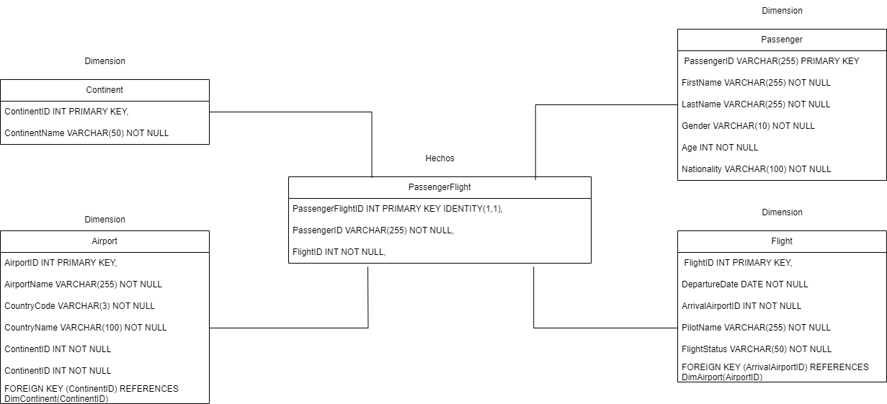

# PRACTICA 1 - 202000343
 
## Luis Manuel Chay Marroquin

## MODELO WAREHOUSE

El modelo warehouse usa el modelo de estrella, en el cual se tiene una tabla de hechos y varias tablas de dimensiones. En este caso se tienen las siguientes tablas:
 
 1. Tabla de hechos: 

- PassengerFlights: Es la tabla central que registra los eventos de pasajeros en vuelos.

2. Tablas de dimensiones:
- Passengers: Contiene información sobre los pasajeros.
- Flights: Contiene información sobre los vuelos.
- Airports: Contiene información sobre los aeropuertos.
- Continents: Contiene información sobre los continentes.




## Menu principal

El menu principal se encarga de mostrar las opciones que el usuario puede elegir, y de acuerdo a la opcion seleccionada, se ejecuta la funcion correspondiente.

```python
def menu():
    print("================MENU+===============")
    print("1. Borrar modelo")
    print("2. Crear modelo")
    print("3. Extraer informacion")
    print("4. Cargar informacion")
    print("5. Realizar consultas")
    print("6. Salir")
    print("=====================================")

    choice = input("Introduce el numero de la opcion: ")

    if choice == "1":
        borrarModelo()
    elif choice == "2":
        crearModelo()
    elif choice == "3":
        extraerInfo()
    elif choice == "4":
        cargarInfo()
    elif choice == "5":
        consultas()
    elif choice == "6":
        print("Saliendo del programa")
    else:
        print("La opcion no es valida")
        menu()
```

### Borrar modelo

Esta funcion se encarga de borrar el modelo de la base de datos, para ello se ejecuta un script sql que se encuentra en la carpeta sql.

```python
def borrarModelo():
    try:
        print("============BORRAR MODELO============")
        ruta = r"C:\Users\Admin\Documents\U\wDecimo Semestre\Semi\Lab\Semi2_202000343\Practica_1\sql\borrarmodelo.sql"
        comando = f'sqlcmd -S (localdb)\\MSSQLLocalDB -d pr1semi2 -i "{ruta}" -C'
        os.system(comando)
        print("Modelo borrado con éxito")
    except Exception as e:
        print(f"Error al borrar el modelo: {e}")
    menu()
```

```sql
DROP TABLE IF EXISTS PassengerFlights;
DROP TABLE IF EXISTS Flights;
DROP TABLE IF EXISTS Passengers;
DROP TABLE IF EXISTS Airports;
DROP TABLE IF EXISTS Continents;
DROP TABLE IF EXISTS TempPassengers;
```

### Crear modelo

Esta funcion se encarga de crear el modelo de la base de datos, para ello se ejecuta un script sql que se encuentra en la carpeta sql.

```python
def crearModelo():
    try:
        print("===========CREAR MODELO============")
        ruta = r"C:\Users\Admin\Documents\U\wDecimo Semestre\Semi\Lab\Semi2_202000343\Practica_1\sql\crearmodelo.sql"
        # Asegúrate de usar la interpolación de cadenas correctamente
        comando = f'sqlcmd -S (localdb)\\MSSQLLocalDB -d pr1semi2 -i "{ruta}" -C'
        os.system(comando)
        print("Modelo creado con éxito")
    except Exception as e:
        print(f"Error al crear el modelo: {e}")
    menu()
```

```sql
-- Crear tabla Continents
CREATE TABLE Continents (
    ContinentID INT PRIMARY KEY IDENTITY(1,1),
    ContinentName VARCHAR(50) NOT NULL
);

-- Crear tabla Airports
CREATE TABLE Airports (
    AirportID INT PRIMARY KEY IDENTITY(1,1),
    AirportName VARCHAR(255) NOT NULL,
    CountryCode VARCHAR(3) NOT NULL,
    CountryName VARCHAR(100) NOT NULL,
    ContinentID INT NOT NULL,
    ArrivalAirportCode VARCHAR(255),  -- Campo para almacenar el código del aeropuerto de llegada
    FOREIGN KEY (ContinentID) REFERENCES Continents(ContinentID),
);

-- Crear tabla Passengers
CREATE TABLE Passengers (
    PassengerID VARCHAR(255) PRIMARY KEY,
    FirstName VARCHAR(255) NOT NULL,
    LastName VARCHAR(255) NOT NULL,
    Gender VARCHAR(10) NOT NULL,
    Age INT NOT NULL,
    Nationality VARCHAR(100) NOT NULL
);

-- Crear tabla Flights
CREATE TABLE Flights (
    FlightID INT PRIMARY KEY IDENTITY(1,1),
    DepartureDate DATE NOT NULL,
    ArrivalAirportID INT NOT NULL,  -- Cambiado para usar AirportID
    PilotName VARCHAR(255) NOT NULL,
    FlightStatus VARCHAR(50) NOT NULL,
    FOREIGN KEY (ArrivalAirportID) REFERENCES Airports(AirportID)  -- Relación con la tabla Airports por AirportID
);

-- Crear tabla PassengerFlights (tabla intermedia)
CREATE TABLE PassengerFlights (
    PassengerFlightID INT PRIMARY KEY IDENTITY(1,1),
    PassengerID VARCHAR(255) NOT NULL,
    FlightID INT NOT NULL,
    FOREIGN KEY (PassengerID) REFERENCES Passengers(PassengerID),
    FOREIGN KEY (FlightID) REFERENCES Flights(FlightID)
);
```

### Extraer informacion

Esta funcion se encarga de extraer la informacion de un archivo csv, para ello se solicita la ruta del archivo y se crea un archivo sql con el script necesario para realizar el bulk insert.

```python
def extraerInfo():
    global ruta
    print("============EXTRAER INFORMACION===========")
    ruta = input("Introduce la ruta del archivo: ")
    print("Ruta obtenida")
    
    bulk_insert_sql = f"""BULK INSERT TempPassengers
    FROM '{ruta}'
    WITH (
        FIELDTERMINATOR = ';',
        ROWTERMINATOR = '\\n',
        FIRSTROW = 2,
        CODEPAGE = '65001'
    );
    """
    #Creamos archivo SQL
    with open("sql/bulkinsert.sql", "w") as f:
        f.write(bulk_insert_sql)
    menu()
``` 

### Cargar informacion

Esta funcion se encarga de cargar la informacion del archivo csv a la base de datos, para ello se ejecuta un script sql que se encuentra en la carpeta sql.

```python
def cargarInfo():
    global ruta
    if not ruta:
        print("La ruta no está especificada")
        return


    print("============CARGAR INFORMACION===========")
    rutatablatemp = r"C:\Users\Admin\Documents\U\wDecimo Semestre\Semi\Lab\Semi2_202000343\Practica_1\sql\creartemp.sql"
    rutabulkinsert = r"C:\Users\Admin\Documents\U\wDecimo Semestre\Semi\Lab\Semi2_202000343\Practica_1\sql\bulkinsert.sql"
    rutainsert = r"C:\Users\Admin\Documents\U\wDecimo Semestre\Semi\Lab\Semi2_202000343\Practica_1\sql\insertardatos.sql"
    try:
        system(f'sqlcmd -S (localdb)\\MSSQLLocalDB -d pr1semi2 -i "{rutatablatemp}" -C')
    except Exception as e:
        print(f"Error al crear la tabla temporal: {e}")
            
    try:    
        system(f'sqlcmd -S (localdb)\\MSSQLLocalDB -d pr1semi2 -i "{rutabulkinsert}" -C')
    except Exception as e:
        print(f"Error al cargar la información: {e}")
        
    try:        
        system(f'sqlcmd -S (localdb)\\MSSQLLocalDB -d pr1semi2 -i "{rutainsert}" -C')
    except Exception as e:
        print(f"Error al insertar los datos: {e}")
    menu()
```

Archivo creacion Tabla Temporal

```sql
-- Crear tabla temporal
CREATE TABLE TempPassengers (
    PassengerID VARCHAR(255),
    FirstName VARCHAR(255),
    LastName VARCHAR(255),
    Gender VARCHAR(10),
    Age VARCHAR(10),
    Nationality VARCHAR(100),
    AirportName VARCHAR(255),
    CountryCode VARCHAR(3),
    CountryName VARCHAR(100),
    AirportContinent VARCHAR(50),
    Continents VARCHAR(50),
    DepartureDate VARCHAR(20),
    ArrivalAirport VARCHAR(255),
    PilotName VARCHAR(255),
    FlightStatus VARCHAR(50)
);
```

Archivo Insercion de datos

```sql
-- Eliminar registros duplicados en la tabla temporal basados en PassengerID
WITH CTE AS (
    SELECT 
        PassengerID, 
        ROW_NUMBER() OVER (PARTITION BY PassengerID ORDER BY (SELECT NULL)) AS rn
    FROM TempPassengers
)
DELETE FROM TempPassengers
WHERE PassengerID IN (
    SELECT PassengerID
    FROM CTE
    WHERE rn > 1
);

-- Insertar Continentes únicos
INSERT INTO Continents (ContinentName)
SELECT DISTINCT AirportContinent
FROM TempPassengers
WHERE AirportContinent IS NOT NULL
AND NOT EXISTS (
    SELECT 1 FROM Continents WHERE ContinentName = TempPassengers.AirportContinent
);

-- Insertar Aeropuertos
INSERT INTO Airports (AirportName, CountryCode, CountryName, ContinentID, ArrivalAirportCode)
SELECT DISTINCT
    tp.AirportName,
    tp.CountryCode,
    tp.CountryName,
    c.ContinentID,
    tp.ArrivalAirport
FROM TempPassengers tp
JOIN Continents c ON c.ContinentName = tp.AirportContinent
WHERE tp.AirportName IS NOT NULL
AND tp.CountryCode IS NOT NULL
AND tp.CountryName IS NOT NULL
AND NOT EXISTS (
    SELECT 1 FROM Airports
    WHERE AirportName = tp.AirportName
    AND CountryCode = tp.CountryCode
    AND CountryName = tp.CountryName
);

-- Insertar Pasajeros
INSERT INTO Passengers (PassengerID, FirstName, LastName, Gender, Age, Nationality)
SELECT DISTINCT
    tp.PassengerID,
    tp.FirstName,
    tp.LastName,
    tp.Gender,
    TRY_CAST(tp.Age AS INT),
    tp.Nationality
FROM TempPassengers tp
WHERE tp.PassengerID IS NOT NULL
AND NOT EXISTS (
    SELECT 1 FROM Passengers p
    WHERE p.PassengerID = tp.PassengerID
);

-- Insertar Vuelos
INSERT INTO Flights (DepartureDate, ArrivalAirportID, PilotName, FlightStatus)
SELECT DISTINCT 
    tp.DepartureDate, 
    a.AirportID,  -- Usar AirportID en lugar de ArrivalAirportName
    tp.PilotName, 
    tp.FlightStatus
FROM TempPassengers tp
JOIN Airports a ON a.AirportName = tp.AirportName  -- Unir con Airports para obtener el AirportID
WHERE tp.DepartureDate IS NOT NULL
AND tp.ArrivalAirport IS NOT NULL
AND NOT EXISTS (
    SELECT 1 FROM Flights 
    WHERE DepartureDate = tp.DepartureDate
    AND ArrivalAirportID = a.AirportID  -- Comparar por AirportID
    AND PilotName = tp.PilotName
);

-- Insertar relaciones de Pasajeros y Vuelos
INSERT INTO PassengerFlights (PassengerID, FlightID)
SELECT 
    tp.PassengerID, 
    f.FlightID
FROM TempPassengers tp
JOIN Passengers p ON tp.PassengerID = p.PassengerID
JOIN Flights f ON 
    tp.DepartureDate = f.DepartureDate 
    AND f.ArrivalAirportID = (
        SELECT TOP 1 AirportID 
        FROM Airports 
        WHERE AirportName = tp.AirportName
    )  -- Comparar por AirportID
    AND tp.PilotName = f.PilotName
WHERE tp.PassengerID IS NOT NULL
AND f.FlightID IS NOT NULL;

-- Verificar datos en las tablas finales
SELECT COUNT(*) FROM Passengers;
SELECT COUNT(*) FROM Flights;
SELECT COUNT(*) FROM PassengerFlights;
SELECT COUNT(*) FROM Airports;
SELECT COUNT(*) FROM Continents;

-- Eliminar tabla temporal
DROP TABLE TempPassengers;
```


## Submenu consultas

Este submenu se encarga de mostrar las opciones de consulta que el usuario puede elegir, y de acuerdo a la opcion seleccionada, se ejecuta la funcion correspondiente.

```python
def consultas():
    print("==============CONSULTAS=============")
    print("1. Consulta 1")
    print("2. Consulta 2")
    print("3. Consulta 3")
    print("4. Consulta 4")
    print("5. Consulta 5")
    print("6. Consulta 6")
    print("7. Consulta 7")
    print("8. Consulta 8")
    print("9. Consulta 9")
    print("10. Consulta 10")
    print("11. Volver al menu principal")
    print("=====================================")

    choice2 = input("Elige una consulta: ")

    if choice2 == "1":
        consulta1()
    elif choice2 == "2":
        consulta2()
    elif choice2 == "3":
        consulta3()
    elif choice2 == "4":
        consulta4()
    elif choice2 == "5":
        consulta5()
    elif choice2 == "6":
        consulta6()
    elif choice2 == "7":
        consulta7()
    elif choice2 == "8":
        consulta8()
    elif choice2 == "9":
        consulta9()
    elif choice2 == "10":
        consulta10()
    elif choice2 == "11":
        menu()
    else:
        print("La consulta no es valida")
        consultas()
```

### Consulta 1

Esta funcion  muestra un conteo de todas las tablas para ver si se realizo la carga en las tablas del modelo

```python
def consulta1():
    print("==========CONSULTA 1===========")
    rutaconsulta1 = r"C:\Users\Admin\Documents\U\wDecimo Semestre\Semi\Lab\Semi2_202000343\Practica_1\sql\consulta1.sql"
    rutaout = r"C:\Users\Admin\Documents\U\wDecimo Semestre\Semi\Lab\Semi2_202000343\Practica_1\out\consulta1.txt"

    system(f'sqlcmd -S (localdb)\\MSSQLLocalDB -d pr1semi2 -i "{rutaconsulta1}" -C')
    system(f'sqlcmd -S (localdb)\\MSSQLLocalDB -d pr1semi2 -i "{rutaconsulta1}" -o "{rutaout}" -C')
    consultas()
```

Archivo SQL de la consulta 1

```sql
SELECT COUNT(*) AS [Cantidad de Pasajeros] from Passengers;
SELECT COUNT(*) AS [Cantidad de vuelos] from Flights;
SELECT COUNT(*) AS [Cantidad de aeropuertos] from Airports;
SELECT COUNT(*) AS [Cantidad de continentes] from Continents;
SELECT COUNT(*) AS [Cantidad de registros en tabla intermedia] from PassengerFlights;
```

### Consulta 2

Esta funcion muestra ek porcentaje de pasajeros por genero

```python
def consulta2():
    print("==========CONSULTA 2===========")
    rutaconsulta2 = r"C:\Users\Admin\Documents\U\wDecimo Semestre\Semi\Lab\Semi2_202000343\Practica_1\sql\consulta2.sql"
    rutaout = r"C:\Users\Admin\Documents\U\wDecimo Semestre\Semi\Lab\Semi2_202000343\Practica_1\out\consulta2.txt"

    system(f'sqlcmd -S (localdb)\\MSSQLLocalDB -d pr1semi2 -i "{rutaconsulta2}" -C')
    system(f'sqlcmd -S (localdb)\\MSSQLLocalDB -d pr1semi2 -i "{rutaconsulta2}" -o "{rutaout}" -C')
    consultas()
```

Archivo SQL de la consulta 2

```sql
DECLARE @TotalFlights INT;
SELECT @TotalFlights = COUNT(DISTINCT FlightID)
FROM Flights;

WITH GenderFlightCount AS (
    SELECT
        p.Gender,
        COUNT(DISTINCT pf.FlightID) AS FlightCount
    FROM Passengers p
    JOIN PassengerFlights pf ON p.PassengerID = pf.PassengerID
    GROUP BY p.Gender
),
GenderFlightPercentage AS (
    SELECT
        Gender,
        CAST(FlightCount AS FLOAT) / @TotalFlights * 100 AS Percentage
    FROM GenderFlightCount
)
-- Seleccionar los resultados
SELECT
    Gender as Genero,
    Percentage as Porcentaje
FROM GenderFlightPercentage;
```

### Consulta 3

Esta funcion de mostrar las nacionalidades con su mes/año de mayor fecha de salida

```python
def consulta3():
    print("==========CONSULTA 3===========")
    rutaconsulta3 = r"C:\Users\Admin\Documents\U\wDecimo Semestre\Semi\Lab\Semi2_202000343\Practica_1\sql\consulta3.sql"
    rutaout = r"C:\Users\Admin\Documents\U\wDecimo Semestre\Semi\Lab\Semi2_202000343\Practica_1\out\consulta3.txt"

    system(f'sqlcmd -S (localdb)\\MSSQLLocalDB -d pr1semi2 -i "{rutaconsulta3}" -C')
    system(f'sqlcmd -S (localdb)\\MSSQLLocalDB -d pr1semi2 -i "{rutaconsulta3}" -o "{rutaout}" -C')
    consultas()
```
```sql 
SET QUOTED_IDENTIFIER ON;
DECLARE @cols AS NVARCHAR(MAX);
DECLARE @query AS NVARCHAR(MAX);

SELECT @cols = STUFF((
    SELECT DISTINCT 
        ',' + QUOTENAME(FORMAT(DepartureDate, 'MM-yyyy'))
    FROM Flights
    FOR XML PATH(''), TYPE
).value('.', 'NVARCHAR(MAX)'), 1, 1, '');

-- Paso 3: Comprobar si la lista de columnas no está vacía
IF @cols IS NULL OR @cols = ''
BEGIN
    PRINT 'No hay fechas disponibles en la tabla Flights.';
    RETURN;
END

SET @query = '
SELECT 
    Nationalidad, ' + @cols + '
FROM 
(
    SELECT 
        p.Nationality AS Nationalidad, 
        FORMAT(f.DepartureDate, ''MM-yyyy'') AS MonthYear
    FROM 
        Passengers p
    JOIN 
        PassengerFlights pf ON p.PassengerID = pf.PassengerID
    JOIN 
        Flights f ON pf.FlightID = f.FlightID
) AS SourceTable
PIVOT (
    COUNT(MonthYear)
    FOR MonthYear IN (' + @cols + ')
) AS PivotTable
ORDER BY Nationalidad;
';

EXEC sp_executesql @query;
```

### Consulta 4

Esta funcion cuenta los vuelos por pais

```python
def consulta4():
    print("==========CONSULTA 4===========")
    rutaconsulta4 = r"C:\Users\Admin\Documents\U\wDecimo Semestre\Semi\Lab\Semi2_202000343\Practica_1\sql\consulta4.sql"
    rutaout = r"C:\Users\Admin\Documents\U\wDecimo Semestre\Semi\Lab\Semi2_202000343\Practica_1\out\consulta4.txt"

    system(f'sqlcmd -S (localdb)\\MSSQLLocalDB -d pr1semi2 -i "{rutaconsulta4}" -C')
    system(f'sqlcmd -S (localdb)\\MSSQLLocalDB -d pr1semi2 -i "{rutaconsulta4}" -o "{rutaout}" -C')
    consultas()
```

archivo SQL de la consulta 4

```sql
SELECT 
    a.CountryName,
    COUNT(f.FlightID) AS NumberOfFlights
FROM 
    Flights f
JOIN 
    Airports a ON f.ArrivalAirportID = a.AirportID
GROUP BY 
    a.CountryName
ORDER BY 
    NumberOfFlights DESC;

```

### Consulta 5

Esta funcion muestra los 5 aeropuertos con mayor numero de pasajeros
```python
def consulta5():
    print("==========CONSULTA 5===========")
    rutaconsulta5 = r"C:\Users\Admin\Documents\U\wDecimo Semestre\Semi\Lab\Semi2_202000343\Practica_1\sql\consulta5.sql"
    rutaout = r"C:\Users\Admin\Documents\U\wDecimo Semestre\Semi\Lab\Semi2_202000343\Practica_1\out\consulta5.txt"

    system(f'sqlcmd -S (localdb)\\MSSQLLocalDB -d pr1semi2 -i "{rutaconsulta5}" -C')
    system(f'sqlcmd -S (localdb)\\MSSQLLocalDB -d pr1semi2 -i "{rutaconsulta5}" -o "{rutaout}" -C')
    consultas()
```

Archivo SQL de la consulta 5

```sql
WITH PassengerCounts AS (
    SELECT 
        a.AirportName,
        COUNT(pf.PassengerID) AS PassengerCount
    FROM 
        Airports a
    JOIN 
        Flights f ON a.AirportID = f.ArrivalAirportID
    JOIN 
        PassengerFlights pf ON f.FlightID = pf.FlightID
    GROUP BY 
        a.AirportName
)
SELECT 
    AirportName,
    PassengerCount
FROM 
    PassengerCounts
ORDER BY 
    PassengerCount DESC
OFFSET 0 ROWS FETCH NEXT 5 ROWS ONLY;

```

### Consulta 6

Esta funcion muestra el conteo de vuelos por estado de vuelo

```python
def consulta6():
    print("==========CONSULTA 6===========")
    rutaconsulta6 = r"C:\Users\Admin\Documents\U\wDecimo Semestre\Semi\Lab\Semi2_202000343\Practica_1\sql\consulta6.sql"
    rutaout = r"C:\Users\Admin\Documents\U\wDecimo Semestre\Semi\Lab\Semi2_202000343\Practica_1\out\consulta6.txt"

    system(f'sqlcmd -S (localdb)\\MSSQLLocalDB -d pr1semi2 -i "{rutaconsulta6}" -C')
    system(f'sqlcmd -S (localdb)\\MSSQLLocalDB -d pr1semi2 -i "{rutaconsulta6}" -o "{rutaout}" -C')
    consultas()
```

Archivo SQL de la consulta 6

```sql
WITH FlightCountByStatus AS (
    SELECT
        f.FlightStatus,
        COUNT(f.FlightID) AS FlightCount
    FROM Flights f
    GROUP BY f.FlightStatus
)

-- Seleccionar el conteo de vuelos por estado de vuelo
SELECT
    FlightStatus as EstadoVuelo,
    FlightCount as ConteoVuelos
FROM FlightCountByStatus
ORDER BY FlightCount DESC;
```

### Consulta 7

Esta funcion el top 5 de paises mas visitados
```python
def consulta7():
    print("==========CONSULTA 7===========")
    rutaconsulta7 = r"C:\Users\Admin\Documents\U\wDecimo Semestre\Semi\Lab\Semi2_202000343\Practica_1\sql\consulta7.sql"
    rutaout = r"C:\Users\Admin\Documents\U\wDecimo Semestre\Semi\Lab\Semi2_202000343\Practica_1\out\consulta7.txt"

    system(f'sqlcmd -S (localdb)\\MSSQLLocalDB -d pr1semi2 -i "{rutaconsulta7}" -C')
    system(f'sqlcmd -S (localdb)\\MSSQLLocalDB -d pr1semi2 -i "{rutaconsulta7}" -o "{rutaout}" -C')
    consultas()
```

Archivo SQL de la consulta 7

```sql
WITH CountryVisitCounts AS (
    SELECT
        a.CountryName,
        COUNT(f.FlightID) AS VisitCount
    FROM
        Airports a
    JOIN
        Flights f ON a.AirportID = f.ArrivalAirportID
    GROUP BY
        a.CountryName
)
SELECT
    CountryName,
    VisitCount
FROM
    CountryVisitCounts
ORDER BY
    VisitCount DESC
OFFSET 0 ROWS FETCH NEXT 5 ROWS ONLY;

```

### Consulta 8

Esta funcion muestra el top 5 de continentes mas visitados

```python
def consulta8():
    print("==========CONSULTA 8===========")
    rutaconsulta8 = r"C:\Users\Admin\Documents\U\wDecimo Semestre\Semi\Lab\Semi2_202000343\Practica_1\sql\consulta8.sql"
    rutaout = r"C:\Users\Admin\Documents\U\wDecimo Semestre\Semi\Lab\Semi2_202000343\Practica_1\out\consulta8.txt"

    system(f'sqlcmd -S (localdb)\\MSSQLLocalDB -d pr1semi2 -i "{rutaconsulta8}" -C')
    system(f'sqlcmd -S (localdb)\\MSSQLLocalDB -d pr1semi2 -i "{rutaconsulta8}" -o "{rutaout}" -C')
    consultas()
```

Archivo SQL de la consulta 8

```sql
WITH ContinentVisitCounts AS (
    SELECT
        c.ContinentName,
        COUNT(f.FlightID) AS VisitCount
    FROM
        Airports a
    JOIN
        Flights f ON a.AirportID = f.ArrivalAirportID
    JOIN
        Continents c ON a.ContinentID = c.ContinentID
    GROUP BY
        c.ContinentName
)
SELECT
    ContinentName,
    VisitCount
FROM
    ContinentVisitCounts
ORDER BY
    VisitCount DESC
OFFSET 0 ROWS FETCH NEXT 5 ROWS ONLY;

```

### Consulta 9

Esta funcion muestra el top 5 de edades y genero que mas viajan

```python
def consulta9():
    print("==========CONSULTA 9===========")
    rutaconsulta9 = r"C:\Users\Admin\Documents\U\wDecimo Semestre\Semi\Lab\Semi2_202000343\Practica_1\sql\consulta9.sql"
    rutaout = r"C:\Users\Admin\Documents\U\wDecimo Semestre\Semi\Lab\Semi2_202000343\Practica_1\out\consulta9.txt"

    system(f'sqlcmd -S (localdb)\\MSSQLLocalDB -d pr1semi2 -i "{rutaconsulta9}" -C')
    system(f'sqlcmd -S (localdb)\\MSSQLLocalDB -d pr1semi2 -i "{rutaconsulta9}" -o "{rutaout}" -C')
    consultas()
```

Archivo SQL de la consulta 9

```sql
WITH AgeGenderTravelCount AS (
    SELECT
        p.Gender,
        p.Age,
        COUNT(DISTINCT pf.PassengerID) AS TravelCount
    FROM 
        Passengers p
    JOIN 
        PassengerFlights pf ON p.PassengerID = pf.PassengerID
    GROUP BY 
        p.Gender,
        p.Age
),
RankedAgeGender AS (
    SELECT
        Gender,
        Age,
        TravelCount,
        ROW_NUMBER() OVER (PARTITION BY Gender ORDER BY TravelCount DESC) AS rn
    FROM 
        AgeGenderTravelCount
)
-- Seleccionar el Top 5 de edades para cada género
SELECT
    Gender AS Genero,
    Age AS Edad,
    TravelCount AS Conteo
FROM 
    RankedAgeGender
WHERE 
    rn <= 5
ORDER BY 
    Gender, Conteo DESC;

```

### Consulta 10

Esta funcion muestra el conteo de vuelos por mes y año

```python
def consulta10():
    print("==========CONSULTA 10===========")
    rutaconsulta10 = r"C:\Users\Admin\Documents\U\wDecimo Semestre\Semi\Lab\Semi2_202000343\Practica_1\sql\consulta10.sql"
    rutaout = r"C:\Users\Admin\Documents\U\wDecimo Semestre\Semi\Lab\Semi2_202000343\Practica_1\out\consulta10.txt"

    system(f'sqlcmd -S (localdb)\\MSSQLLocalDB -d pr1semi2 -i "{rutaconsulta10}" -C')
    system(f'sqlcmd -S (localdb)\\MSSQLLocalDB -d pr1semi2 -i "{rutaconsulta10}" -o "{rutaout}" -C')
    consultas()
```

Archivo SQL de la consulta 10

```sql
WITH MonthlyFlightCount AS (
    SELECT
        FORMAT(f.DepartureDate, 'MM-yyyy') AS MesAnio,
        COUNT(f.FlightID) AS ConteoVuelos
    FROM Flights f
    GROUP BY FORMAT(f.DepartureDate, 'MM-yyyy')
)

-- Seleccionar los resultados ordenados por mes y año
SELECT
    MesAnio AS Fecha,
    ConteoVuelos AS ConteoVuelos
FROM MonthlyFlightCount
ORDER BY MesAnio;
```