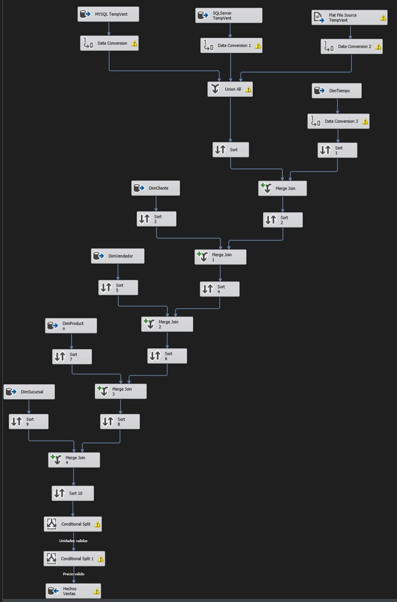

# PROYECTO
# Luis Manuel Chay Marroquín - 202000343

# MODELO

Para este proyecto se realiza un proyecto constelacion, el cual se basa de dos tablas de hechos que estan relacionadas entre si a una o mas tablas dimension. Para este caso se realizo de la siguiente manera:

## Tablas Relacionadas con Compras:
**HechosCompras**: Esta es la tabla de hechos que almacena los datos específicos de las transacciones de compras. Se relaciona con las siguientes dimensiones:
- **DimProducto**: Almacena la información del producto comprado.
- **DimProveedor**: Almacena la información del proveedor relacionado con la compra.
- **DimSucursal**: Almacena la información de la tienda donde se realizó la compra.
- **DimTiempo**: Almacena la fecha en que se realizó la compra.

## Tablas Relacionadas con Ventas:
**HechosVentas**: Esta es la tabla de hechos que almacena los datos específicos de las transacciones de ventas. Se relaciona con las siguientes dimensiones:
- **DimProducto**: Almacena la información del producto vendido.
- **DimCliente**: Almacena la información del cliente relacionado con la venta.
- **DimVendedor**: Almacena la información del vendedor asociado a la venta.
- **DimSucursal**: Almacena la información de la tienda donde se realizó la venta.
- **DimTiempo**: Almacena la fecha en que se realizó la venta.


# ETL

Para la realización del ETL se utilizó la herramientas de SSIS, la cual permite realizar la extracción, transformación y carga de datos de manera sencilla. 

## Extracción

Para este modelo se hizo la extraccion de 3 fuentes de datos diferentes de la siguiente manera:

- **SQL SERVER**: Haciendo uso de las herramientas de  SSMS (script) se realizo la extraccion de los datos a partir de dos archivos de texto plano (.comp para las ventas y .vent para las ventas) que luego se cargarian a dos tablas temporales en SQL Server.

```sql
CREATE TABLE TempComp
(
    Fecha VARCHAR(15),
    CodProveedor VARCHAR(15),
    NombreProveedor VARCHAR(100),
    DireccionProveedor VARCHAR(200),
    NumeroProveedor VARCHAR(15),
    WebProveedor VARCHAR(2),
    CodProducto VARCHAR(15),
    NombreProducto VARCHAR(100),
    MarcaProducto VARCHAR(50),
    Categoria VARCHAR(50),
    SodSuSucursal VARCHAR(50),
    NombreSucursal VARCHAR(50),
    DireccionSucursal VARCHAR(200),
    Region VARCHAR(50),
    Departamento VARCHAR(50),
    Unidades VARCHAR(20),
    CostoU VARCHAR(20)
);

CREATE TABLE TempVent
(
    Fecha VARCHAR(15),
    CodCliente VARCHAR(15),
    NombreCliente VARCHAR(100),
    TipoCliente VARCHAR(50),
    DireccionCliente VARCHAR(200),
    NumeroCliente VARCHAR(15),
    CodVendedor VARCHAR(15),
    NombreVendedor VARCHAR(100),
    Vacacionista VARCHAR(5),
    CodProducto VARCHAR(15),
    NombreProducto VARCHAR(100),
    MarcaProducto VARCHAR(50),
    Categoria VARCHAR(50),
    SodSuSucursal VARCHAR(50),
    NombreSucursal VARCHAR(50),
    DireccionSucursal VARCHAR(200),
    Region VARCHAR(50),
    Departamento VARCHAR(50),
    Unidades VARCHAR(20),
    PrecioU VARCHAR(20)
);
```
- **MySQL**: Haciendo uso de las herramientas de  SSMS (script) se realizo la extraccion de los datos a partir de dos archivos de texto plano (.comp para las ventas y .vent para las ventas) que luego se cargarian a dos tablas temporales en MySQL.

```sql
CREATE TABLE IF NOT EXISTS TempComp
(
    Fecha VARCHAR(15),
    CodProveedor VARCHAR(15),
    NombreProveedor VARCHAR(100),
    DireccionProveedor VARCHAR(200),
    NumeroProveedor VARCHAR(15),
    WebProveedor VARCHAR(2),
    CodProducto VARCHAR(15),
    NombreProducto VARCHAR(100),
    MarcaProducto VARCHAR(50),
    Categoria VARCHAR(50),
    SodSuSucursal VARCHAR(50),
    NombreSucursal VARCHAR(50),
    DireccionSucursal VARCHAR(200),
    Region VARCHAR(50),
    Departamento VARCHAR(50),
    Unidades VARCHAR(20),
    CostoU VARCHAR(20)
);

CREATE TABLE IF NOT EXISTS TempVent
(
    Fecha VARCHAR(15),
    CodCliente VARCHAR(15),
    NombreCliente VARCHAR(100),
    TipoCliente VARCHAR(50),
    DireccionCliente VARCHAR(200),
    NumeroCliente VARCHAR(15),
    CodVendedor VARCHAR(15),
    NombreVendedor VARCHAR(100),
    Vacacionista VARCHAR(5),
    CodProducto VARCHAR(15),
    NombreProducto VARCHAR(100),
    MarcaProducto VARCHAR(50),
    Categoria VARCHAR(50),
    SodSuSucursal VARCHAR(50),
    NombreSucursal VARCHAR(50),
    DireccionSucursal VARCHAR(200),
    Region VARCHAR(50),
    Departamento VARCHAR(50),
    Unidades VARCHAR(20),
    PrecioU VARCHAR(20)
)
```

- **Extraccion directa**: Se realizo la extraccion directa de los datos de los archivos de texto plano (.comp para las ventas y .vent para las ventas) que posteriormente iran directo al proceso de transformacion.

## Transformación

Para la transformación de los datos se realizó la limpieza de los mismos, se eliminaron los registros nulos y se realizaron las conversiones necesarias para que los datos sean compatibles con el modelo de datos. Se usaron las herrmientas de SSIS

Para realizar esto realizamos los siguientes pasos:

- **Limpieza de datos**: Se eliminaron los registros nulos de las tablas temporales.
- **Conversion de datos**: Se realizaron las conversiones necesarias para que los datos sean compatibles con el modelo de datos.
- **Validacion de datos**: Se realizaron validaciones para asegurar que los datos sean correctos (numeros positivos, fechas validas, etc).

## Carga (Load)

Posteriormente a la transformacion de datos se procedio a la carga de los mismos a las tablas dimension y tabla de hechos haciendo uso de las herramientas de SSIS.

# Imagenes del flujo

Flujo de ETL para la tabla de hechos de compras:



Flujo general de la aplicacion:

